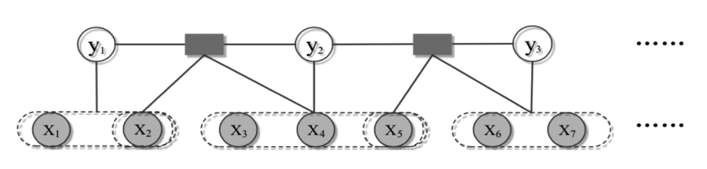
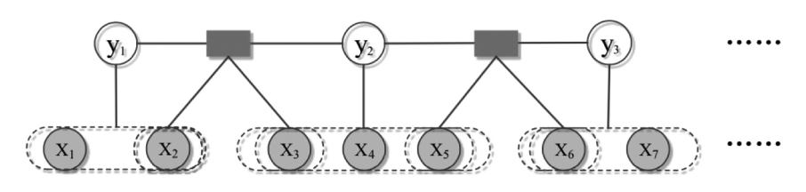

# DM-SMCRFs
This repo contains the code for the research work Duration Modeling with Semi-Markov Conditional Random Fields for Keyphrase Extraction.

We propose a statistical approach called duration modeling with semi-Markov Conditional Random Fields (DM-SMCRFs) for keyphrase extraction. 

- Based on the property of semi-Markov chain, DM-SMCRFs can encode segment-level features and sequentially classify the phrase in the sentence as keyphrase or non-keyphrase. 
- Second, by assuming the independence between state transition and state duration, DM-SMCRFs model the distribution of duration (length) of keyphrases to further explore state duration information, which can help identify the size of keyphrase.
- Based on the convexity of parametric duration feature derived from duration distribution, a constrained Viterbi algorithm is derived to improve the performance of decoding in DM-SMCRFs.
- We collect the datasets from various domains (e.g. History, Economics, Psychology), and evaluate DM-SMCRFs on these datasets.

 

   
The graph structure of CRFs.

 

    
The graph structure of Semi-CRFs.

 

   
The graph structure of DM-SMCRFs. 

 
 
